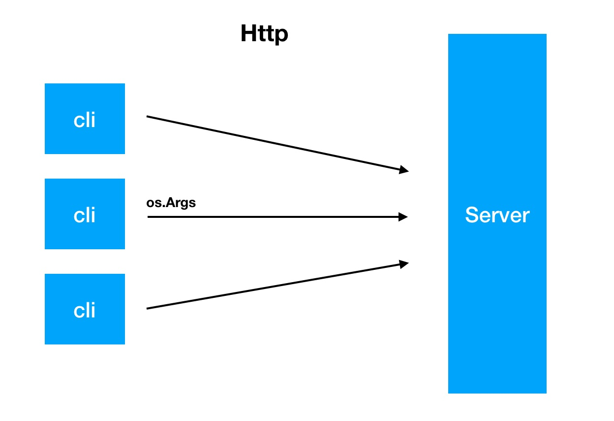

# terminal

terminal is a commander for execute cmd on server side. It has a light client terminal.



### Features
 - [x] execute client terminal cmd args on server.
 - [x] client can set env config and send them to server when execute a remote cmd. 
 - [x] client can update self.


### Usage

`make build` make the binary file for your pc.

 `./bin/darwin/amd64/server` running the server:

``` bash
[GIN-debug] [WARNING] Creating an Engine instance with the Logger and Recovery middleware already attached.

[GIN-debug] [WARNING] Running in "debug" mode. Switch to "release" mode in production.
 - using env:	export GIN_MODE=release
 - using code:	gin.SetMode(gin.ReleaseMode)

[GIN-debug] POST   /v1/execute               --> main.executeEndpoint (5 handlers)
[GIN-debug] Listening and serving HTTP on :8080
```


```./bin/darwin/amd64/cli``` running the client:

```bash
client terminal

Usage:
  cli [flags]
  cli [command]

Available Commands:
  env         manage env config
  help        Help about any command
  test        hello world

Flags:
  -h, --help      help for cli
  -v, --verbose   show more info

Use "cli [command] --help" for more information about a command.
```

